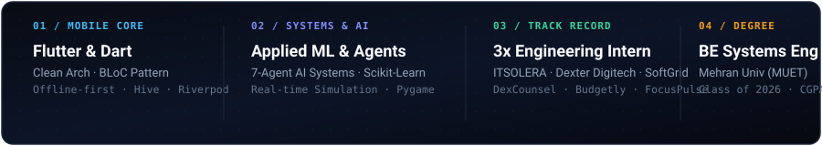

<div align="center">
  
</div>

<br />

<div align="center">
  
</div>

<br />

## ⚡ Engineering Philosophy

I am a **Mobile Application Engineer** and **Computer Systems Engineering student at Mehran University of Engineering & Technology (MUET)**. My primary discipline centers on engineering robust, offline-first mobile applications in **Flutter & Dart**, backed by strict **Clean Architecture**, deterministic state management, and smooth 60fps responsive interfaces.

Beyond native client engineering, I design and integrate **applied machine learning pipelines** and **multi-agent decision systems**—bridging practical client UI with intelligent backend systems (such as real-time simulation engines and autonomous financial decision architectures).

---

## 🚀 Flagship Systems & Repositories

<table>
  <tr>
    <td width="50%" valign="top">
      <h3>🤖 <a href="https://github.com/hashim013/TadbeerAI-AISeehko2026-Hackathon">TadbeerAI</a></h3>
      <p><strong>Autonomous 7-Agent Economic Decision Engine</strong></p>
      <p>A multi-agent intelligence platform built for volatile macroeconomic environments. Orchestrates 7 specialized agents to ingest live economic news, simulate business risk, and formulate actionable tactical countermeasures.</p>
      <p>
        <code>Flutter</code> · <code>Dart</code> · <code>Multi-Agent Architecture</code> · <code>Generative AI</code>
      </p>
      <p>
        <a href="https://github.com/hashim013/TadbeerAI-AISeehko2026-Hackathon"><strong>View Repository →</strong></a>
      </p>
    </td>
    <td width="50%" valign="top">
      <h3>🚦 <a href="https://github.com/hashim013/AI-Powered-Smart-Traffic-Management-System-Simulation-Based">Smart Traffic AI</a></h3>
      <p><strong>Hybrid ML &amp; Real-Time Sensing Simulation</strong></p>
      <p>A closed-loop dynamic traffic signal controller combining macro-level predictive regression (Scikit-Learn Random Forest) with micro-level real-time vehicle queue sensing to eliminate urban gridlocks.</p>
      <p>
        <code>Python</code> · <code>Scikit-Learn</code> · <code>Pygame 2.6</code> · <code>NumPy &amp; Pandas</code>
      </p>
      <p>
        <a href="https://github.com/hashim013/AI-Powered-Smart-Traffic-Management-System-Simulation-Based"><strong>View Repository →</strong></a>
      </p>
    </td>
  </tr>
  <tr>
    <td width="50%" valign="top">
      <h3>⚖️ DexCounsel Client Portal</h3>
      <p><strong>Production Legal Case Progression Mobile Ecosystem</strong></p>
      <p>Engineered for Dexter Digitech to streamline client-lawyer orchestration. Features real-time case progression timelines, secure encrypted document vault, direct messaging channels, and calendar alerts.</p>
      <p>
        <code>Flutter</code> · <code>Dart</code> · <code>Firebase</code> · <code>REST API</code> · <code>Clean Arch</code>
      </p>
      <p>
        <em>Developed during Mobile App Internship at Dexter Digitech</em>
      </p>
    </td>
    <td width="50%" valign="top">
      <h3>⏱️ <a href="https://github.com/hashim013/FocusPulse">FocusPulse</a></h3>
      <p><strong>Minimalist Focus &amp; Productivity Engine</strong></p>
      <p>A performance-tuned Pomodoro and deep-work utility crafted with high-spec Flutter UI principles. Features custom interval timers, distraction-free session telemetry, and zero-latency local caching.</p>
      <p>
        <code>Flutter</code> · <code>Dart</code> · <code>State Management</code> · <code>Local Persistence</code>
      </p>
      <p>
        <a href="https://github.com/hashim013/FocusPulse"><strong>View Repository →</strong></a>
      </p>
    </td>
  </tr>
  <tr>
    <td width="50%" valign="top">
      <h3>📊 <a href="https://github.com/hashim013/budgetly">Budgetly</a></h3>
      <p><strong>Personal Finance &amp; Expense Telemetry</strong></p>
      <p>Financial management application with real-time expenditure charts, monthly budget caps, transaction classification, and instant offline ledger syncing.</p>
      <p>
        <code>Flutter</code> · <code>Dart</code> · <code>Interactive Visuals</code> · <code>Hive</code>
      </p>
      <p>
        <a href="https://github.com/hashim013/budgetly"><strong>View Repository →</strong></a>
      </p>
    </td>
    <td width="50%" valign="top">
      <h3>✅ <a href="https://github.com/hashim013/smart-task-manager">Smart Task Manager</a></h3>
      <p><strong>Categorized Task Architecture with Hive</strong></p>
      <p>Task management system engineered around offline data persistence with Hive, multi-criteria filtering, priority queues, and clean state separation.</p>
      <p>
        <code>Flutter</code> · <code>Dart</code> · <code>Hive Local DB</code> · <code>Clean UI</code>
      </p>
      <p>
        <a href="https://github.com/hashim013/smart-task-manager"><strong>View Repository →</strong></a>
      </p>
    </td>
  </tr>
</table>

---

## 🛠️ Architecture & Technical Stack

```
                                  [ MOBILE APPLICATION LAYER ]
                      Flutter (Dart) ── Material Design 3 ── Responsive UI
                                              │
                                 [ STATE & ARCHITECTURE ]
                     BLoC Pattern ── Provider ── Clean Architecture ── SOLID
                                              │
                                [ PERSISTENCE & SERVICES ]
                       Hive ── SQLite ── Firebase ── REST APIs ── HTTP
                                              │
                                 [ INTELLIGENCE & SYSTEMS ]
                     Multi-Agent Architecture ── Scikit-Learn ── Pygame
```

### Domain Toolkit

| Discipline | Technologies & Frameworks |
| :--- | :--- |
| **Mobile Core & UI** |     |
| **Architecture & State** |     |
| **Data, Persistence & AI** |       |
| **Engineering Workflow** |       |

---

## 💼 Industry Experience & Milestones

<table>
  <thead>
    <tr>
      <th align="left">Organization</th>
      <th align="left">Role</th>
      <th align="left">Key Contributions</th>
      <th align="right">Timeline</th>
    </tr>
  </thead>
  <tbody>
    <tr>
      <td><strong>ITSOLERA Pvt Ltd</strong></td>
      <td>Flutter Developer (Android) Intern</td>
      <td>Architected modular mobile applications following clean architecture principles. Engineered <em>Smart Task Manager</em>, <em>Budgetly</em>, and <em>FocusPulse</em> with dynamic state machines and local database persistence.</td>
      <td align="right"><code>Jan 2026 – Apr 2026</code></td>
    </tr>
    <tr>
      <td><strong>Dexter Digitech</strong></td>
      <td>Mobile Application Intern</td>
      <td>Built client-facing modules for <em>DexCounsel</em>: real-time lawyer-client communication, dynamic case status timeline, encrypted legal document vault, and calendar reminders.</td>
      <td align="right"><code>Jun 2026 – Aug 2026</code></td>
    </tr>
    <tr>
      <td><strong>SoftGrid Solutions</strong></td>
      <td>Mobile &amp; UI Engineering</td>
      <td>Implemented interactive UI components, data visualization screens, and responsive cross-platform layout optimizations.</td>
      <td align="right"><code>2026</code></td>
    </tr>
    <tr>
      <td><strong>Alibaba x Alkhidmat Hackathon</strong></td>
      <td>AI Engineer &amp; Mobile Lead</td>
      <td>Engineered the <em>TadbeerAI</em> 7-agent decision platform, integrating macroeconomic telemetry with real-time Flutter interfaces.</td>
      <td align="right"><code>Aug 2026</code></td>
    </tr>
  </tbody>
</table>

---

## 📈 Engineering Activity & Telemetry

<div align="center">
  
</div>

---

## 📬 Connect & Collaborate

<div align="center">
  <p>Interested in collaborating on mobile applications, clean architecture systems, or applied AI engineering?</p>

  <a href="https://www.linkedin.com/in/muhammad-hashim-611781263/">
    
  </a>
  &nbsp;
  <a href="mailto:muhammadhashimdev36@gmail.com">
    
  </a>
  &nbsp;
  <a href="https://github.com/hashim013">
    
  </a>
</div>

<br />

<div align="center">
  <sub>Handcrafted with intentional design · Built for performance, readability, and scale.</sub>
</div>
